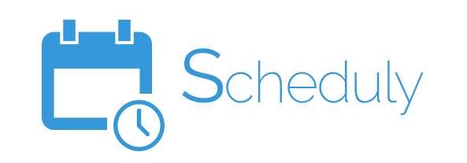

# Scheduly
Scheduly is a Lightweight NodeJS Webhooks scheduler

# Prerequisite
- [Docker] (https://www.docker.com)

# Deployement
## Environment variables
- `MONGO_URL`
- `NODE_ENV` (possible values: production or developpement)
- `IP` (default localhost)

## In production
### Build
- `docker build -t scheduly .`
- `docker run --rm -ti -p 8080:8080 -v "$PWD":/usr/src/app scheduly ./minify.sh`

### Run
- `docker run --rm -ti -p 8080:8080 -v "$PWD":/usr/src/app --net host -e "NODE_ENV=production" -e "MONGO_URL=mongodb://<YOUR MONGO URL>" scheduly`

# Full documentation
## Table of Contents
- [Creating jobs](#creating-jobs)
- [Updating jobs](#updating-jobs)
- [Getting jobs](#getting-jobs)
- [Removing jobs](#removing-jobs)
- [Errors](#errors)
- [Deploy in development](#deploy-in-development)

## Creating Jobs
Creates a webhook with the given body and returns the jobs.
##### Required body:
- URL
- Scheduling Interval ([cron format] (http://www.nncron.ru/help/EN/working/cron-format.htm) or [human interval] (https://github.com/rschmukler/human-interval))
- Body

### Example
- `POST http://localhost:3000/webhooks`
- Body :
``` javascript
{  
   "url": "myurl.com",
   "scheduling": "* * * * *",
   "body": {  
      "hello":"world"
   }
}
```
- Response type:
``` javascript
[
  {
    "name": "webhook",
    "id": "5730a487a3dc0e13009c0a45",
    "url": "myurl.com",
    "body": {
      "hello": "world"
    },
    "lastRunAt": "...",
    "lastFinishedAt": "...",
    "nextRunAt": "2016-05-09T14:56:00.246Z"
  }
]
```
- Status: `200`

---------------------------------------
##### Note:
- If `scheduling interval` is at the cron format, the job will be executed every `scheduling interval`.
- If `scheduling inverval` is at the human interval format, the job will be executed once at `scheduling interval`.

## Updating Jobs
Updates a given webhooks with the new body and returns the jobs updated.
##### Required body:
- URL
- Scheduling Interval ([cron format] (http://www.nncron.ru/help/EN/working/cron-format.htm) or [human interval] (https://github.com/rschmukler/human-interval))
- Body

## Example
- `PUT http://localhost:3000/webhooks/5730a487a3dc0e13009c0a45`
- Body :
``` javascript
{  
   "url": "myurl.com",
   "scheduling": "in 2 minutes",
   "body": {  
      "hello":"world"
   }
}
```
- Response type:
``` javascript
[
  {
    "name": "webhook",
    "id": "5730a487a3dc0e13009c0a45",
    "url": "myurl.com",
    "body": {
      "hello": "world"
    },
    "lastRunAt": "...",
    "lastFinishedAt": "...",
    "nextRunAt": "2016-05-09T14:56:00.246Z"
  }
]
```
- Status: `200`

---------------------------------------
##### Note:
- If `scheduling interval` is at the cron format, the job will be executed every `scheduling interval`.
- If `scheduling inverval` is at the human interval format, the job will be executed once at `scheduling interval`.

## Getting Jobs
If a query parameters (`offset` and `limit`) are given, returns paginated jobs or returns all jobs

## Example
- `GET http://localhost:3000/webhooks`
- Response type:
``` javascript
[
  {
    "name": "webhook",
    "id": "5730a487a3dc0e13009c0a45",
    "url": "myurl.com",
    "body": {
      "hello": "world"
    },
    "lastRunAt": "...",
    "lastFinishedAt": "...",
    "nextRunAt": "2016-05-09T14:56:00.246Z",
    "status": "scheduled"
  }
]
```
- Status: `200`

---------------------------------------
- `GET http://localhost:3000/webhooks/5730a487a3dc0e13009c0a45`
- Response type:
``` javascript
[
  {
    "name": "webhook",
    "id": "5730a487a3dc0e13009c0a45",
    "url": "myurl.com",
    "body": {
      "hello": "world"
    },
    "lastRunAt": "...",
    "lastFinishedAt": "...",
    "nextRunAt": "2016-05-09T14:56:00.246Z",
    "status": "scheduled"
  }
]
```
- Status: `200`

---------------------------------------
- `GET http://localhost:3000/webhooks?offset=4&limit=2`
- Response type:
``` javascript
[
  {
    "name": "webhook",
    "id": "5730a487a3dc0e13009c0a45",
    "url": "myurl.com",
    "body": {
      "hello": "world"
    },
    "lastRunAt": "...",
    "lastFinishedAt": "...",
    "nextRunAt": "2016-05-09T14:56:00.246Z",
    "status": "scheduled"
  },
  {
    "name": "webhook",
    "id": "5730a487a3dc0e13009c0a46",
    "url": "myurl.com",
    "body": {
      "hello": "world"
    },
    "lastRunAt": "...",
    "lastFinishedAt": "...",
    "nextRunAt": "2016-05-09T14:56:00.246Z",
    "status": "scheduled"
  }
]
```
- Status: `200`

## Removing Jobs
Removes the given webhooks if a query parameter (`id`) is given or removes all webhooks

## Example
- `DELETE http://localhost:3000/webhooks`
- Response type: `OK`
- Status: `200`

---------------------------------------
- `DELETE http://localhost:3000/webhooks/5730a487a3dc0e13009c0a45`
- Response type: `OK`
- Status: `200`

# Errors
## Creating a Job
- `POST http://localhost:8080/webhooks`
- Body :
``` javascript
{  
   "url": "myurl.com",
   "scheduling": "* * * * *"
}
```
- Response type: `Missing required parameters`
- Status: `400`

---------------------------------------
- `POST http://localhost:8080/webhooks`
- Body :
``` javascript
{
   "url": "myurl.com",
   "scheduling": "test",
   "body": {  
      "hello":"world"
   }
}
```
- Response type: `test is not a valid time inteval !`
- Status: `400`

## Updating Jobs
- `PUT http://localhost:8080/webhooks/azerty`
- Body :
``` javascript
{  
   "url": "myurl.com",
   "scheduling": "in 2 minutes",
   "body": {  
      "hello":"world"
   }
}
```
- Response type: `No jobs to update`
- Status: `400`

## Getting Jobs
- `GET http://localhost:8080/webhooks/azerty`
- Response type: `No job`
- Status: `400`

---------------------------------------
- `GET http://localhost:8080/webhooks`
- Response type: `No jobs`
- Status: `400`

---------------------------------------
- `GET http://localhost:8080/webhooks?offset=0&limit=4`
- Response type: `No jobs`
- Status: `400`

## Removing Jobs
- `DELETE http://localhost:8080/webhooks/azerty`
- Response type: `No job to remove`
- Status: `400`

---------------------------------------
- `DELETE http://localhost:8080/webhooks`
- Response type: `No jobs to remove`
- Status: `400`

# Deploy in development

## Prerequisite
- [NodeJS] (https://nodejs.org)
- [MongoDB] (https://www.mongodb.com/)
OR
- [Docker] (https://www.docker.com)

## NodeJS
### Build
- `npm install uglify-js -g`
- `npm install clean-css`
- `npm install`
- `./minify.sh`

## Run
- `MONGO_URL=mongodb://<YOUR MONGO URL> npm start`

## Docker
### Build
- `docker build -t scheduly .`
- `docker run --rm -ti -p 8080:8080 -v "$PWD":/usr/src/app scheduly npm install`
- `docker run --rm -ti -p 8080:8080 -v "$PWD":/usr/src/app scheduly ./minify.sh`

### Run
- `docker run --rm -ti -p 8080:8080 -v "$PWD":/usr/src/app --net host -e "MONGO_URL=mongodb://<YOUR MONGO URL>" node:onbuild`
